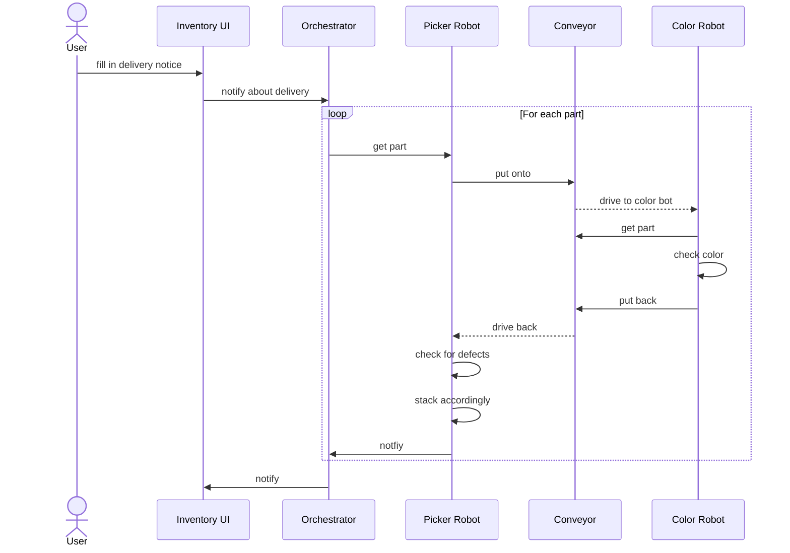

# Event Driven Architecture

This is the project implementation for the event driven and process oriented architecture
course. The project works with the provided robot simulator in the lab.

## How to run the project in dev mode

- build and deploy with dev setting by running `just compose-dev build` and `just compose-dev up -d`
- If the proto files from protobuf have not been generated yet, run `buf generate` in the root directory
- Run the Manager application in dev mode:
1. Open the manager directory in IntelliJ
2. Go on services - Springboot and select the ManagerApplication
3. Right click and select `Edit Configurations`
4. Add `dev` to the Active Profiles
5. If you ran an instance before that did not complete, you might need to delete the `camunda-h2-database.mv.db` folder in the root directory. There currently is a single instance only restriction. 
6. Run the application
- Camunda is running on `localhost:8080` with the credentials `a/a`
- the frontend is running on `http://localhost:3000`
- the kafka broker is running on `localhost:9092`
- to see all the commands and events that can be fired to mimic the hardware run `just`
- 

## Syntax for Just commands
- NFC sensor is: `sensor-nfc-value yes`, `sensor-nfc-value no`, the sensor remembers its last state, so a no must be run sometimes to correctly fire a yes. 

## General workflow

The project will be set up in microservices and communicates via Kafka. The general idea
of the process that is modelled is as follows:

A delivery service will deliver a package from a supplier to a warehouse. The warehouse
has an automated inventory system. An inventory person can set the package on the
predefined spot and then access the web UI to announce a delivery with the respective
delivery notice. Then, the warehouse inventory system will start the process of checking
the delivery. The happy-path includes:

- Each part is picked up by the robot in one of the 3x3 grid cells of the predefined location
- Then the robot places the part onto the NFC reader and associates the part with a unique ID
- The robot then places the part onto the conveyor belt
- The part on the belt is driven down to the color sensor
- The second robot will pick it up and puts it onto the color sensor
- After the color has been determined, the robot puts it back to the conveyor
- After being driven back, the first robot sorts the color onto the respective stack
- With a small chance, the orchestrator will deem a part "broken" and put it onto the broken stack

## Sequence

Please take note that the event based communication is not part of the following sequence diagram.
The diagram shows the happy path if all services are working correctly.

## Possible error scenarios

- In general: if a robot is not able to pick up a certain part
- If the delivery contains wrong information about the amount of parts
- If during the inventoring process, parts are lost

## Process Model Information
### Error Scenarios
Error scenarios are currently managed with manual intervention. We decided to wait for 5 seconds for events to occur. 
Otherwise a manual intervention is triggered. After resolving the last step is repeated.