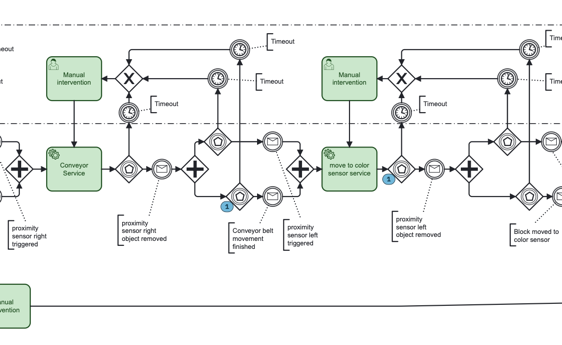

# Things to debug/Open points

- Error in command: commands.machines.v1.MoveBlockFromShipmentToNfc.position: "models.v1.PickupPosition" is not defined.
- Event based gateway: Gateway_1bvg201 (NFC sensor) cannot be triggered on first instance, needs one round of "manual interventio "
- Multiple "instances" in camunda, problem with AND/OR gateways
- how/when to update process variable colour
- inventory system listens to BlockSorted from the Robot, so no need for inventory service task?
- Sometime the parallel gateways are behaving weirdly, the little (1) should not be there but should be waiting for the other one (unless it is always "open" after an event has been detected, which would make error handling really dumb:
- 
-
