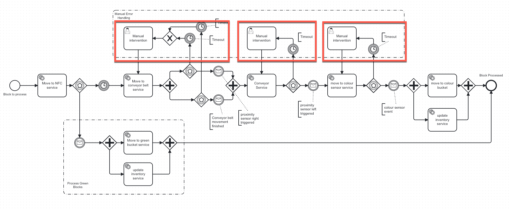

# 12. Human Intervention for missing Events

Date: 2025-03-21

## Status

Accepted

## Context

Within our event-driven and process-oriented workflow architecture, certain events may be lost or fail to trigger due to system faults, network issues, or as we expect, hardware issues. 
This missing event scenario can halt the progression of our workflow, creating risks to the overall system's reliability and throughput. 
At the moment we expect this to happen at three stages, where it can be detected automatically.
1. Picker robot: Block is moved to the conveyor belt
   1. Event from right sensor missing, that a block was detected.
2. Conveyor belt: Block moved to color robot pickup point
   1. Event from left sensor missing, that a block was detected.
3. Color robot: Block is moved to color sensor
   1. Event from color sensor service missing.

## Decision

We will implement human intervention as a stateful resilience pattern within our workflow. This means when an expected event is not received within a predefined timeout, the system transitions into a state awaiting human interaction. 
The system's current state, at the point of failure, will be persisted to allow manual recovery or intervention. After human intervention, the last action will be repeated.

## Rationale

- Human intervention provides a controlled method to handle exceptional cases, avoiding indefinite suspension of workflow processes.
- Maintaining a stateful context allows human operators to easily understand the situation and intervene effectively.
- Without seeing the robots and conveyor belt in action it is not determinable, if a stateful retry could be applicable.
- 

## Consequences

### Positive

- Improved resilience to unexpected scenarios or failures.
- Reduced risk of indefinite process blockage.
- Enhanced observability and controllability in failure scenarios.

### Negative

- Introduction of manual interventions could lead to increased operational overhead.
- Potentially slower recovery times compared to automated solutions.

## Conclusion

If future tests with the actual hardware indicate errors that could be handled more appropriately with a stateful automated retry, this decision will be reconsidered. 
For example, if a robot fails to grab a block and the block remains in place, the robot could automatically retry grabbing it without requiring human intervention.