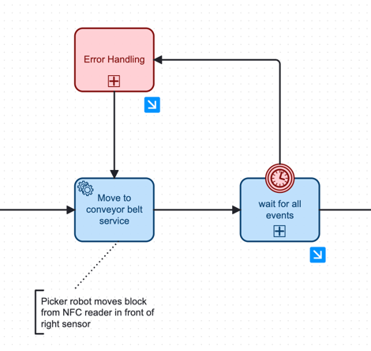
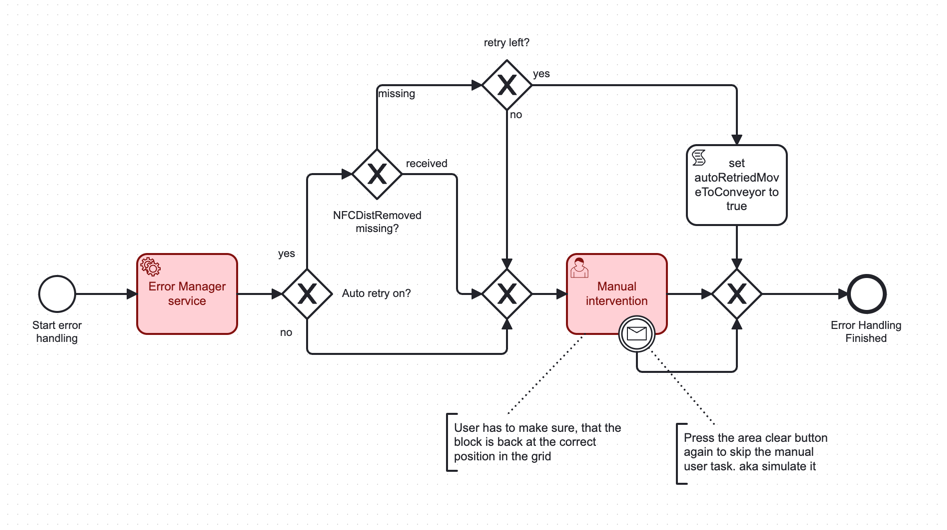

# 13. Stateful Resilience Pattern for missing Events

Date: 2025-03-25

## Status

Accepted

Supercedes [12. Human Intervention for missing Events](0012-human-intervention-for-missing-events.md)

## Context

Within our event-driven and process-oriented workflow architecture, certain events may be lost or fail to trigger due to system faults, network issues, or as we expect, hardware issues.  
This missing event scenario can halt the progression of our workflow, creating risks to the overall system's reliability and throughput.  
At the moment, we expect this to happen at three stages, where it can be detected automatically:

1. **Picker robot: Block moved to NFC reader**
   - Event from picker robot missing (block positioned on NFC reader).
   - Event from nfc (distance) sensor missing (block detection).
2. **Picker robot: Block moved to conveyor belt**
    - Event from nfc (distance) sensor missing (block removal).
    - Event from right sensor missing (block detection).
    - Event from robot missing (block placed on conveyor belt).
2. **Picker robot: Block sorted in green basket**
    - Event from nfc (distance) sensor missing (block removal).
    - Event from nfc (tag) sensor missing (tag removal).
    - Event from picker robot missing (green block sorted).
3. **Conveyor belt: Block moved to color robot pickup point**
    - Event from left sensor missing (block detection).
    - Event from right sensor missing (block removal).
    - Event from conveyor belt missing (block movement).
4. **Color robot: Block moved to color sensor**
    - Event from color sensor service missing (color detection).
    - Event from left sensor missing (block removal).
    - Event from color robot missing (block positioned on color sensor).
5. **Color robot: Block sorted in non-green basket**
    - Event from color robot missing (block sorted).

Within a timeout period the process waits for all events to arrive, otherwise the error handling is triggered.

## Decision

We will implement stateful retry and human intervention in combination as a stateful resilience pattern within our workflow. This means when an expected event is not received within a predefined timeout, the system transitions into an error-handling state.  
The system's current state, at the point of failure, will be persisted to allow automatic retry or manual recovery or intervention.

## Implementation

It is configurable via [`application.properties`](../../src/manager/src/main/resources/application.properties), defining which error handling blocks will attempt an automatic retry and which rely solely on manual intervention.  
This allows configuring the error handling based on tests with the actual hardware.

If the automatic retries fail, the process will always end in manual intervention.
The auto-retry mechanism can only be triggered, if certain events are missing. Mainly the distance sensors determine if a block is still in its original position and a auto-retry could therefore be successful.
The manual user task can be skipped with the are clear button, for testing purposes.

## Rationale

- Robots can automatically retry simple steps, such as grabbing the block from the grid.
- Human intervention provides a controlled method to handle exceptional cases, avoiding indefinite suspension of workflow processes.
- Maintaining a stateful context allows human operators to easily understand the situation and intervene effectively.

## Consequences

### Positive

- Improved resilience through automated retries of simple actions (e.g., robotic grabs).
- Reduced human involvement in frequent, easily resolvable scenarios, freeing resources for more complex tasks.
- Enhanced reliability and predictability of workflow executions due to clearly defined state transitions.
- Easier debugging and operational transparency by maintaining persistent states at failure points.
- Improved overall operational efficiency and responsiveness, avoiding unnecessary workflow delays.

### Negative

- Increased system complexity due to additional error-handling logic.
- Potentially larger message payloads or additional data storage required to persist state information.
- Configuration complexity to correctly set thresholds for automated retry versus manual intervention.
- Risks of repetitive automated failures if underlying issues aren't promptly resolved.

## Conclusion

The introduction of a stateful resilience pattern combining automatic retries and human intervention provides improved fault tolerance and operational efficiency in handling missing or delayed events.  
This approach balances operational efficiency and human control by automating simple retries and reserving human intervention for exceptional or complex error scenarios.

If future hardware test runs indicate errors that could be handled more appropriately with additional automated stateful retries, this is already fully configurable.