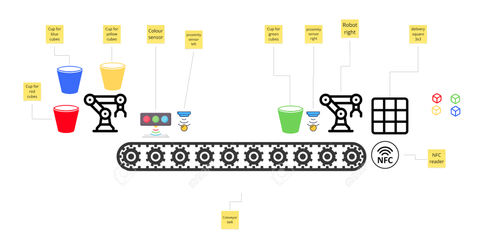
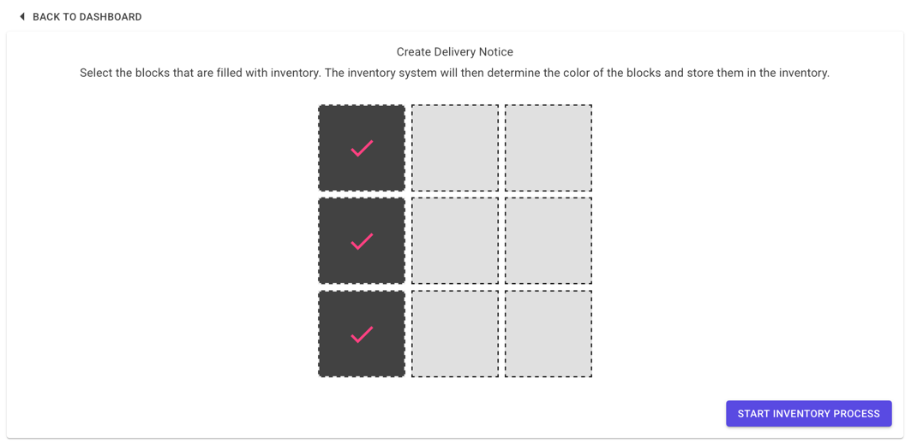
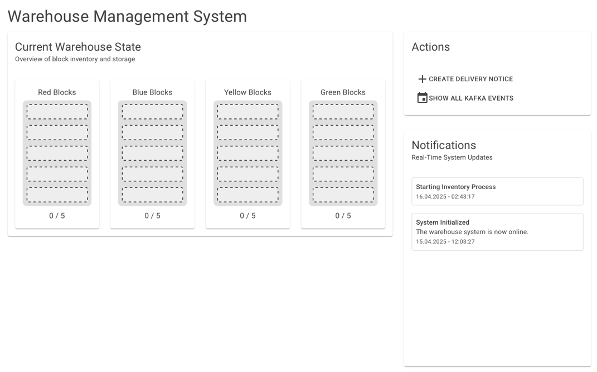
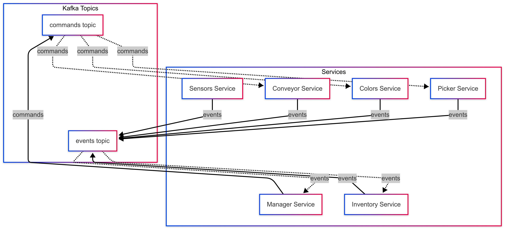
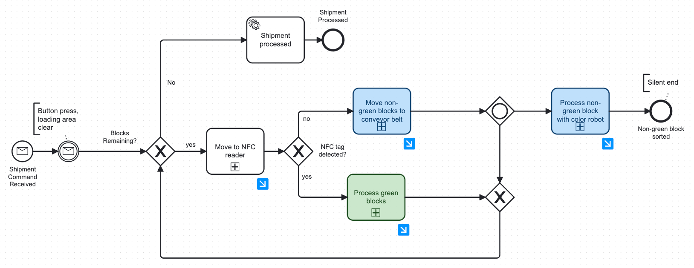
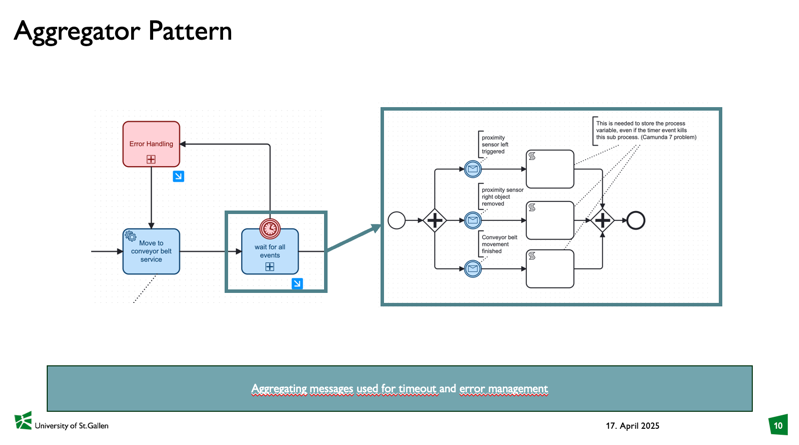
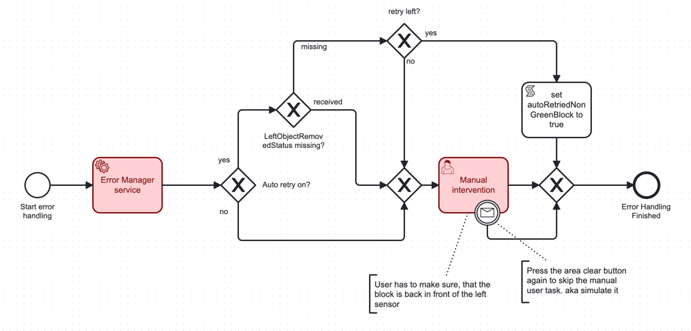
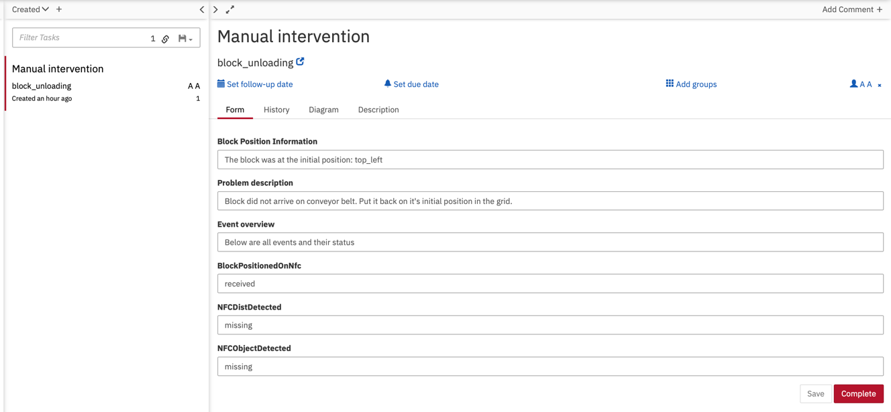
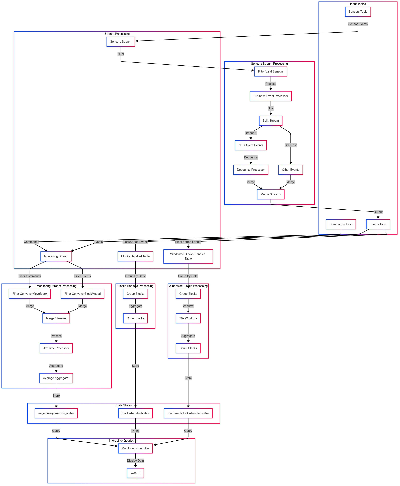

# Assignment 1 - Report Software Project

All changes to this document can be found in the [changelog](../changelog.md).

For the software project for this course we have decided to go and implement a color sorting workflow as provided in the Lab. The goal is to sort the provided colored blocks, in blue, yellow, green and red, into the corresponding bucket. For this there are two Debot Robot arms, a conveyor belt between the two robots and a handful of different sensors. The sensors that are provided are a color sensor, several distance sensors and an NFC-reader. The NFC reader is important as the color sensor cannot distinguish between green and yellow. Therefore, the green blocks have been equipped with NFC tags so that they can be differentiated by the existence of an NFC-tag from the yellow blocks. There is also a button provided. We have used this button to have the user mark "area clear". Further, we 3D printed a 3x3 grid that fits 9 of these colored blocks. This grid serves as our delivery bay, here blocks are placed to be then processed by the robots. A note on the robots in use. They are both the same type and are relatively "dumb", which however makes them rather simple to work with for rigid workflows. Movement patterns are recorded manually, which create a script of movements. This script can then simply be called and the robot will repeat the recorded movements. This however requires the block to always be quite precisely in the same place. Otherwise, the robot will miss the block and has no way to correct for the slightly altered position.

The workflow, on a very high level is as follows:

- The blocks are placed in the 3x3 grid by the "delivery person"
- The delivery person fills in a delivery notice in our front-end
- Button needs to be pressed to indicate "area clear"
- Robot right (Picker) picks up workpiece and checks if it has an NFC-tag with the sensor
- If yes: Block is sorted directly into the green bucket and next block is picked up
- If no: Block is placed on the conveyor belt for further processing
- Block is moved to the left side of the conveyor belt
- Block is picked up by the left robot (Color) which checks the color of the block with the color sensor and proceeds to sort the block into the corresponding bucket.
- Now the next block can be sorted.
- When all blocks are sorted the shipment is marked as complete.

To ensure the workpieces arrive at the next stage of the process, the proximity sensors are used to detect the workpieces and if not errors are thrown. These can include automatic retries as well as user intervention paired with a service task.

Below is a diagram depicting the set-up in the lab.

This is the front-end that we have created to allow the user to fill in the delivery notice. Here the delivery person can select which slots of the grid have blocks that need to be sorted.

There is also a simple web page that shows the current status of the inventory. It is updated once a block is sorted into the corresponding bucket.

### See it in action

Here you can access the video to see the whole workflow in action of the robots completing one whole workflow and sorting the cubes.

[EDPO_midterm-HD 1080p.mov](https://universitaetstgallen-my.sharepoint.com/:v:/g/personal/geroalexander_traem_student_unisg_ch/Eed8I_5RJzpNnkKoQnTzfw4BlxOIEzgpehG4iY0VWU9wvw?nav=eyJyZWZlcnJhbEluZm8iOnsicmVmZXJyYWxBcHAiOiJPbmVEcml2ZUZvckJ1c2luZXNzIiwicmVmZXJyYWxBcHBQbGF0Zm9ybSI6IldlYiIsInJlZmVycmFsTW9kZSI6InZpZXciLCJyZWZlcnJhbFZpZXciOiJNeUZpbGVzTGlua0NvcHkifX0&e=JIGZ91)

[EDPO-midterm-comparison-HD 1080p.mov](https://universitaetstgallen-my.sharepoint.com/:v:/g/personal/geroalexander_traem_student_unisg_ch/ERJbnlgJ-LlLizY-FDc8EMwBjzMbSMrmnh_XgXJ1UYmbXQ?nav=eyJyZWZlcnJhbEluZm8iOnsicmVmZXJyYWxBcHAiOiJPbmVEcml2ZUZvckJ1c2luZXNzIiwicmVmZXJyYWxBcHBQbGF0Zm9ybSI6IldlYiIsInJlZmVycmFsTW9kZSI6InZpZXciLCJyZWZlcnJhbFZpZXciOiJNeUZpbGVzTGlua0NvcHkifX0&e=TeGywN)

[EDPO-midterm-error-HD 1080p.mov](https://universitaetstgallen-my.sharepoint.com/:v:/g/personal/geroalexander_traem_student_unisg_ch/EVOex_pPVH1Crxjys2ReOpoBzwyE8BhbSZX7UaVVDdJPTg?nav=eyJyZWZlcnJhbEluZm8iOnsicmVmZXJyYWxBcHAiOiJPbmVEcml2ZUZvckJ1c2luZXNzIiwicmVmZXJyYWxBcHBQbGF0Zm9ybSI6IldlYiIsInJlZmVycmFsTW9kZSI6InZpZXciLCJyZWZlcnJhbFZpZXciOiJNeUZpbGVzTGlua0NvcHkifX0&e=l6mkjg)

### Implementation at a conceptual level

Following is an overview of the most important implementations at a conceptual level.

##### Kafka implementation

We have decided to go with two Kafka topics for our implementation (as documented in ADR 14): a command-bus for direct service instructions and an event-bus for state updates. This separation allows us to maintain clear control flow through commands (e.g., `ConveyorMoveBlock` from manager to conveyor service) while enabling loose coupling through events (e.g., `BlockSorted` events from color robot to inventory service). This dual approach provides both structured workflow control and flexible state management.

The diagram illustrates our Kafka implementation with two distinct topics. The command-bus shows the manager service sending specific commands to each service. Some examples of this are: `MoveToNfc` and `MoveToConveyor` to the picker robot, `ConveyorMoveBlock` to the conveyor service, and `MoveToColor` and `MoveToBucket` to the color robot. The event-bus shows how services publish their state changes: the picker, for example, emits `BlockPositionedOnNfc` and `BlockPositionedOnConveyor`, the conveyor service sends `ConveyorBlockMoved`, and the color robot publishes `BlockSorted`. The inventory service consumes these events to maintain the current state of sorted blocks. Overall, this topology shows a very simple implementation of a Kafka framework, with two topics, showing that the separation of concerns is achieved.

- Event-bus
  Here updates from different services are emitted. This can for example be one of the robots notifying that they are done or a sensor that they have detected a block at their location. The events that are emitted here transmit information.

In most cases multiple of these are needed for the workflow to be moved on to the next stage. For example, before the workflow can move on to the conveyor belt, the event of the robot that the last workflow is finished needs to be received as well as the event from the proximity sensor on the conveyor belt.

- Command-bus
  The command-bus has the sole purpose to send instructions to a service. This is a strict 1:1 communication. Here it is expected that there is an action taken by the service that received the command. For example, when the manager service sends a `ConveyorMoveBlock` command to the conveyor service, it expects the conveyor to physically move the block from one position to another. This is a direct instruction that requires immediate action from the receiving service.

##### Microservices

- Manager - the manager is the orchestrator of the system. It is the heart that controls the whole workflow. Here the Camunda workflow is deployed as well as all the glue code and task delegations needed. Here Commands and Events can be emitted and received and passed onto the Camunda workflow.
- Sensor - this service translates the MQTT sensor data to relevant business events. To not have Kafka clogged up with irrelevant sensor events, such as the NFC-reading sending the read NFC-ID every second when a block is placed on the sensor, this service aggregates the sensor data and emits business events that can be better interpreted by the other services.
- Picker Robot - This service is the robot that is on the right side in the lab, here scripts can be called to take certain actions. In the case it is getting a block from one of the nine delivery locations from the grid and place it on the NFC sensor. Further, the robot can move a block from the sensor to the conveyor belt or drop a block in the bucket for the green blocks.
- Color Robot - This is the robot on the left of the conveyor belt. It similarly to the other robot receives instruction sets. Here the robot can move from the conveyor to the color sensor and then from the color sensor to the different buckets.
- Conveyor - This service is solely responsible for the conveyor belt. The time it takes for the conveyor belt to move from right to left is fixed so that it is always ensured that the block arrives at the right place.
- Inventory - This service contains the frontend application for the whole system. It consists of the overview which shows what has already been sorted. Above the screenshots of the frontend were already shown. There is also a database in this service that persists the current amount of blocks in each bucket.

##### Camunda workflow

To conceptualize the implementation of this, below is a simplified version of the overall Camunda workflow. The full workflow that is deployed in the manager service can be found here: `/src/manager/src/main/resources/separate_robot_movement_v2.bpmn`

- Shipment Command Received: As described above firstly the delivery person used the front-end to create a delivery notice. This sends out a Kafka command "ProcessNewShipment". This is picked up by the CommandListener in the manager service and this will trigger the creation of a new process instance.
- The workflow now waits for a button press by the user. This is to ensure that the workbench is clear and the robots are not obstructed. The press of the button sends out a Kafka event that the area is clear.
- As we arrive at the gateway for the first time, there are of course blocks remaining.
- Then we get to the unloading of the first block on the "Move to NFC reader". Here the sub-process executes getting one of the blocks that were specified in the shipment note and place it on the NFC sensor.
- If the block does have an NFC tag it can be directly processed as "Process green blocks" and the robot picks up the green block and places it in the bucket for the green blocks. From there it goes back to check if there is another block.
- When there is no NFC detected the block needs to be moved to the other robot by the conveyor belt. This process is started as the service places the block on the conveyor belt and moves it to the other side.
- Now we get to the gateway which allows for simultaneous work between the two robots. On the one hand the color robot now gets the instruction to pick up the workpiece and check its color from the color sensor and place it in the corresponding bucket. When these processes are done, there is a silent end.
- At the same time the workflow goes back to check if there are still workpieces remaining. This allows the picker robot to already start working and checking the next workpiece for an NFC tag while the color robot is still executing the sorting.
- This simplified process omits the checks that are in the deployed model so that there is no collision and the picker robot waits until the conveyor belt is cleared again.
- Once there are no workpieces remaining there is an event that is sent out showing that the shipment has been processed. The system is now ready for the next shipment.
- With the current implementation there is only allowed to be one shipment at a time. This makes sense as there cannot be a new delivery while a process is running. This is as the grid with the block represents a full shipment (one can think of this of a delivery truck parking in a loading bay). This does not change until the shipment is processed and the next "truck" is ready to be unloaded.

### Concepts and Implementation

-> Event-based state transfer for the blocks
The events transfer some states. For example "ProcessNewShipment" contains information about the block count. Camunda uses this information to calculate actions and the finish-line for when all blocks are sorted.

-> Event notification
We have implemented event notifications throughout the system. The first obvious one is the sensor service that emits business level events as described in ADR17. But also the robots and the conveyor belt publish events when a change has occurred. One example of this is the robots being done with a workflow and sending out an event where the block was placed. This means the robots always reference what process they have just finished and not just that they have finished. This makes it much easier for the error handling so that the user can know exactly what process was just tried.

-> Orchestration vs Choreography
As discussed in the lecture and already in ADR5 we wanted to show both orchestration and choreography in our system. Most of the system is designed in an orchestrated way. The decision to do this was due to the inherent semantic coupling that the hardware setup has, something that will be referenced again below in the discussion. This means that almost all commands are sent from the orchestrator to the services and services therefore only act when spoken to from the orchestrator. In our case this is the manager service with the running deployment of Camunda. We also implemented choreography. There are two specific use cases. One is the changing of the speed of the conveyor belt. For this there is a rotary dial in the hardware setup. When this knob is turned the speed of the conveyor belt will change. Due to limitations with the conveyor belt this will only show an effect for the next instruction sent to conveyor after the changing of the dial. Here the sensor service emits an event into the Kafka events topic. This is directly picked up by the sensor service and adjust the speed for the next instruction. The second use case is the updating in the inventory. When a block is sorted the color robot publishes an event that a block was sorted with the corresponding color. This event is also directly consumed by the inventory service and updates the GUI as well as the database of this new block.

-> Aggregator model

Our implementation of the Aggregator Pattern (as documented in ADR-0015) uses BPMN in Camunda to handle asynchronous events from multiple services. The pattern is implemented through a collapsed sub-process that collects messages from various sources, such as robot completion events and sensor readings. Each message is captured through parallel intermediate catch events, allowing the system to wait for all required events before proceeding. A boundary timer event ensures that the process doesn't stall indefinitely if events are missing or delayed, triggering appropriate error handling or compensation paths. This implementation provides clear visibility into the system's state while maintaining flexibility in handling asynchronous events.

### Discussions, trade-offs, decisions, results and insights

-> Protobuf
Please see ADR 4.

-> Implementation of sensor service
Please see ADR 17.

-> Semantic Coupling
Inherent coupling that exists in the problem domain, in our case the restraints of the flow of the hardware and some restrictions with the software of the robots and conveyor. For example, we cannot start processing a new block from our starting position before the NFC sensor has been cleared. This goes for almost all positions in our system, so they are always waiting time as no two blocks can occupy the same place in the process and cannot get overtaken.

-> Unavailability of services
It is important to note, that we have a very coupled system on the hardware side. This is because the physical workflow is very sequential and there is no opportunity (in the current implementation) to manage a queue.
A possible extension for this could be for example when the color robot is down. There could be a queue of workpieces that can be placed along the conveyor belt. This would allow for a more flexible system but also will create more complexity when executing.
In the current system however, when the color robot is down, the rest of the system can keep working as long as there are only green workpieces provided. This is the same for the conveyor belt.
Similarly, if the picker robot is down, the color robot can keep working as long as there are blocks on the conveyor belt. This is a trade-off between flexibility and complexity.

-> Camunda is great
We enjoyed using Camunda, especially as we started to change the workflow. Being able to change the business logic and not needing to change the services. This can also be seen in our comparison video. Here we changed the BPMN to have both robots working simultaneously, where possible and no collision may occur. In our previous iteration the processing of the next block only began once the first block was fully processed. In the current model the next block may be initiated even when the color robot is still working on a block. This change was done by only changing the BPMN, and it decreased the time to process a shipment significantly.

-> Timing issues
Physical execution of task takes time but there are also time-outs needed. A good example of this is the NFC-reader. Here we need a timeout, after the robot has moved the block to the NFC reader to determine, that a block has no NFC tag if nothing is detected within a certain amount of time. Getting these timings right, finding a good trade-off between real-world performance, i.e. having a fault-tolerant system and getting the tasks done, without waiting too long for things to time out is an issue that needs testing and fine-tuning to optimize the system. At this point
To facilitate further testing and optimization these time-out times can be adjusted in the build file to allow easy changing of this parameter.

-> Missing events
In some instances we had an issue where we "missed" events. What is meant by this is that an event, or an update, from a service would be published before Camunda was ready to receive that message. Here some small wait times were implemented to make sure these events arrived reliably.

-> Error handling - Manual retry with user task and auto-retry with service task

Our system implements a comprehensive error handling strategy that combines automatic retries with manual intervention capabilities. The workflow monitors for expected events from sensors and robots, triggering an error if these events are not received within a configured time frame. When an error occurs, the system first attempts an automatic retry by sending a command to the robot to repeat its last movement. This auto-retry feature can be toggled on and off, though in practice we typically run without it as most errors require direct user intervention.

The error handling workflow is implemented through a combination of automatic and manual processes. The system waits for sensor events and robot completion notifications, throwing an error if these are not received within the specified time frame. The automatic retry mechanism attempts to resolve the issue by instructing the robot to retry its last movement. If this fails, the system creates a user task for manual intervention.

The manual intervention process is managed through Camunda's task list interface. When a user task is created, it includes detailed information about the error scenario through process variables. In the example shown, the system detected that a block did not arrive at the conveyor belt as expected. The task details reveal that while the `BlockPositionedOnNfc` command was completed, neither the distance sensor at the NFC nor the NFC sensor itself registered the block, indicating a transportation issue. The user can resolve this by physically repositioning the block and marking the task as complete, allowing the failed sub-process to be retried.

# Assignment 2 - Kafka & Event-processing 

## Changed microservices

We made several key changes to our microservice architecture. As described in ADR-0024, the Sensor service was simplified to act as a straightforward translator, forwarding MQTT messages directly to Kafka without embedding business logic. To accommodate this change, we introduced a dedicated Kafka topic named "sensor" (see ADR-0025), ensuring that raw sensor data is cleanly separated from business events and commands. With the sensor data now available on its own topic, we added a new Streams service (see ADR-0026), which is responsible for all Kafka Streams processing and table management. This service consumes data from the sensor topic, transforms it into business-level events using stateless processing, and performs aggregations to create KTables. The Streams service also provides a frontend for visualizing these tables, enabling more flexible, scalable, and observable data processing across the system. As a result of these changes, the Inventory service has become redundant, as its reporting functionality is now handled by the Streams service.

# Changed Kafka Implementation 

The system's updated Kafka architecture is built around a comprehensive Kafka Streams processing topology that efficiently handles processing and monitoring. At the top level, three input topics - Sensors, Commands, and Events - feed data into the system. The processing is organized into four main streams: Sensors Stream Processing, Monitoring Stream Processing, Blocks Handled Processing, and Windowed Blocks Processing. The Sensors Stream begins by filtering valid sensor data, processes it through a business event processor, and then splits the stream into NFCObject Events and Other Events, with a debounce processor to handle rapid sensor updates. The Monitoring Stream combines commands and events to calculate processing times, using filters to separate different types of messages before merging them for analysis. The Blocks Handled Processing stream groups and counts blocks, while the Windowed Blocks Processing stream performs similar operations but within 30-second time windows for temporal analysis. The processed data is stored in three state stores: avg-conveyor-moving-table, blocks-handled-table, and windowed-blocks-handled-table. These state stores enable interactive queries through a Monitoring Controller, which powers a Web UI that provides real-time insights into the system's performance and block handling statistics. This architecture ensures efficient real-time processing, reliable state management, and accessible monitoring capabilities for the entire system.

## Stateless Operations 

We implemented several stateless operations in our system, as documented in ADR-0019. These operations are used for direct transformations and filtering of our event streams. Our command-to-event transformations convert incoming commands directly into corresponding events without maintaining any state. For example, when a `ConveyorMoveBlock` command is received, it is transformed into a `ConveyorBlockMoved` event, making the process efficient and straightforward. Our `SensorsStream` implements stateless filtering by removing null values and validating sensor addresses against our allowed combinations list, all without maintaining any state about previous readings. We also use stateless filtering to process specific event types, such as filtering for `BlockSorted` events in our `BlocksHandledTable`, allowing us to focus on relevant events without state maintenance.

The `SensorsStream` further demonstrates the use of filtering, transformation, splitting, and branching. Initially, it filters out any null or invalid sensor messages to ensure only relevant data is processed. It then transforms raw sensor data into structured business-level events, making the information more meaningful for downstream consumers. The stream is then split and branched based on event type: for example, NFC-related events are routed to a dedicated branch for specialized processing, while other sensor events are directed to separate branches. This approach allows each event type to be handled appropriately and efficiently, supporting a modular and scalable event-driven architecture.

## Streams and Tables 

As documented in ADR-0018 and ADR-0020, we implemented both streams and tables in our system to enable robust real-time data processing and state management. The `SensorsStream` ingests raw sensor data from the dedicated Kafka topic and processes it in real time, applying stateless operations such as filtering, transformation, and branching to convert raw messages into business-level events. These processed events are then used to update various Kafka Tables (KTables).

For example, the `BlocksHandledTable` is a KTable that maintains a running count of blocks processed, grouped by color. Each time a `BlockSorted` event is received, the table is updated to increment the count for the corresponding color. The `WindowedBlocksHandledTable` extends this concept by maintaining statistics within defined time windows (e.g., 30-second intervals). 

Additionally, the `MonitoringStream` combines data from both the command and event topics. By correlating commands (such as `ConveyorMoveBlock`) with their resulting events (`ConveyorBlockMoved`), the stream calculates processing times and updates the `avg-conveyor-moving-table`. This table provides a real-time metric, the average conveyor movement duration, which can be queried interactively via the monitoring frontend.

## Multi-Stream Processing 

We implemented multi-stream processing in our monitoring system, as documented in ADR-0022. Our system combines commands and events from different topics, such as merging `ConveyorMoveBlock` commands with `ConveyorBlockMoved` events, enabling us to measure the time between commands and their corresponding events. We achieve stream correlation by using the same key ("avg-conveyor-moving") for both streams, allowing the `AvgTimeProcessor` to calculate time differences between related events.

## Interactive Queries 

As documented in ADR-0021, we implemented interactive queries for our monitoring system. We created a monitoring dashboard using Thymeleaf templates that displays real-time processing statistics, allowing users to view block counts, processing times, and system performance. Our `MonitoringController` provides access to state stores, querying the `windowed-blocks-handled-table` for processing statistics and accessing the `avg-conveyor-moving-table` for performance metrics.

## Windowed Operations 

We implemented windowed operations for time-based analysis in our `WindowedBlocksHandledTable`, as documented in ADR-0018 and ADR-0020. We use 30-second windows for processing statistics, enabling us to track block processing rates over time and analyze system performance. Within these windows, we aggregate block processing counts, providing insights into processing patterns and helping identify system bottlenecks.

## Happy and Sad Path

As documented in ADR-0023, we implemented a comprehensive testing framework that allows us to simulate the entire shipment processing workflow without requiring physical presence in the lab. This framework provides REST endpoints for test control and configuration, enabling us to simulate both successful scenarios (happy paths) and various failure scenarios (sad paths). Through this implementation, we can test the complete workflow, including sensor events, robot movements, and error handling, by simulating commands and events that would normally be triggered by physical hardware. The testing framework supports configurable parameters for shipment blocks, timeouts, and failure points, allowing us to thoroughly validate the system's behavior under different conditions. This has been particularly valuable for development and debugging, as it eliminates the dependency on physical hardware availability and enables rapid iteration of the system's logic. Detailed instructions on how to use the testing framework, including endpoint specifications, parameter configurations, and example requests, can be found in the [Testing Documentation](../Testing%20Documentation.md).

## Reflection

One area for future improvement is the addition of unique identifiers to each event, such as specifying the exact position of a block (e.g., “block top left”). This would make it much easier to measure how long it takes to process individual blocks and to correlate related events throughout the system. Changing this however would have resultet in us having to touch many parts of the system. 
Currently, stream processing and maintaining up-to-date views are not entirely straightforward, especially when trying to access this data from other services. For example, we attempted to connect Grafana for visualization but ultimately accessed the data directly within the stream processing service. This experience highlighted the challenges of sharing and accessing real-time data in a distributed environment and hence why we opted for a new frontend within the new service. 
Another consideration for the future is error handling: if the structure of our data tables changes and new consumers join, they must be able to handle different data formats, particularly when processing older messages. 
Finally, in terms of modularity, we have already improved our system by replacing our earlier Go-based stream processing with a more robust Java implementation, but further refinements and modularization could still be explored

### Release

https://github.com/buehler/mcs-event-driven-systems/releases

The contributions of the different team members can be found under [contributions_log.md](../contributions_log.md) in the Git repository.

Some of the exercises were also updated and can be found under `/doc/exercises`. Please also refer to the [changelog](../changelog.md).