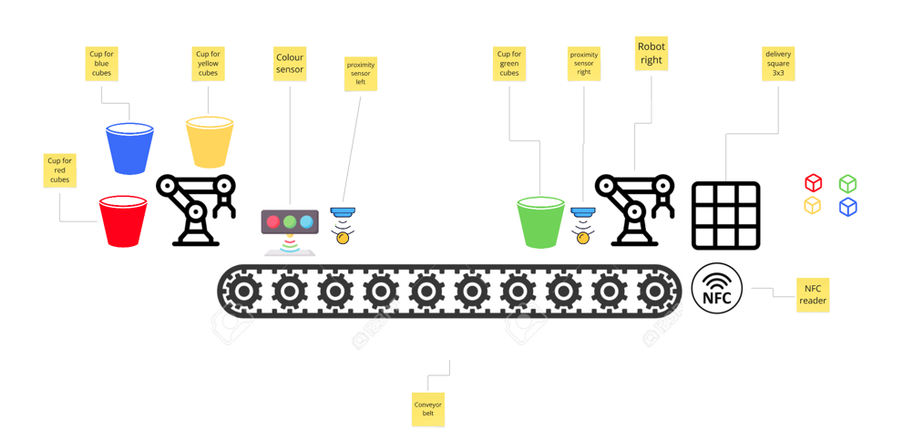
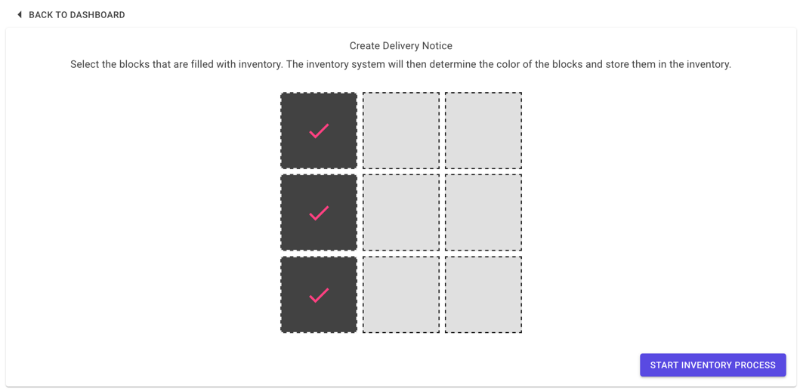
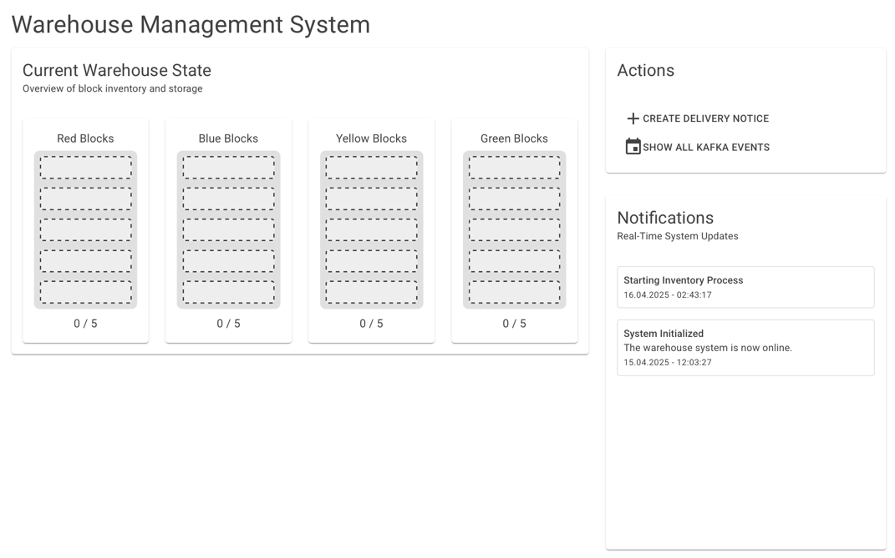
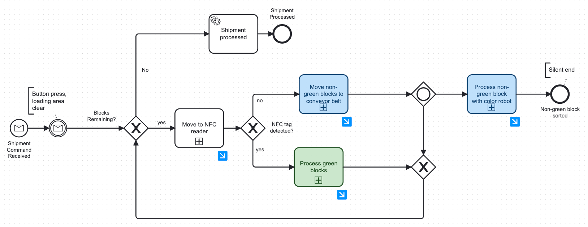
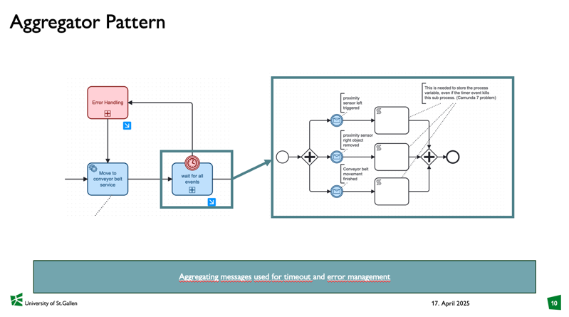
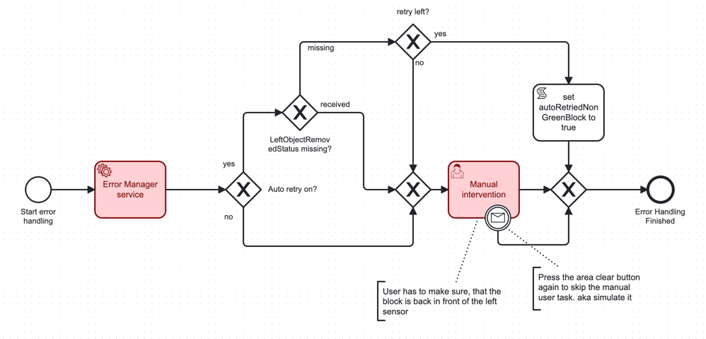

# Assignment 1 - Mid-Term Report Software Project

TO-DO: Update ADR 11

TO-DO: Update ADR Sensor business Idee

### General description;

For the software project for this course we have decided to go and implement a colour soring worklfow as provided in the Lab. The goal is to sort the provided coloured block, in blue, yellow, green and red, into the corresponing bucket. For this there are two Debot Robots arms, a conveyor belt between the two robots and a handful of different sensors. The sensors that are provided are a colour sensors, severals distance sensors and a NFC-reader. The NFC reader is important as the color sensor cannot distinguish between green and yellow. Therefore, the green blocks have been equipped with NFC tags so that they can be differentiated by the existence of an NFC-tag from the yellow blocks. There is also a button provided. We have used this button to have the user mark "area clear". Further, we 3D printed a 3x3 grid that fits 9 of these coloured blocks. This grid serves as our delivery bay, here blocks are placed to be then processed by the robots. A note on the robots in use. They are both the same type and are relatively "dumb", which however makes them rather simple to work with for rigid workflows. Movement patters are recorded manually, which create a script of movements. This scipt can then simply be called and the robot will repeat the recorded movements. This however requires the block to always be quite precisly in the same place. Otherwise the robot will miss the block and has no way to correct for the slightly altered position.

The workflow, on a very high level is as follows:

- The blocks are placed in the 3x3 grid by the "delivery person"
- The delivery person fills in a delivery notice in our front-end
- Button needs to be pressed to indicate "area clear"
- Robot right (Picker) pics up workpiece and checks if it has an NFC-tag with the sensor
- If yes: Block is sorted directly into the green bucket and next block is picked up
- If no: Block is placed on the conveyor belt for further processing
- Block is moved to the left side of the conveyor belt
- Block is picked up by the left robot (Color) which checks the colour of the block with the colour sensor and proceeds to sort the block into the corresponding bucket.
- Now the next block can be sorted.
- When all blocks are sorted the shipment is marked as complete.

To ensure the workpieces arrive at the next stage of the process, the proximity sensors are used to detect the workpieces and if not errors are thrown. These can include automatic retries as well as user intervention paired with a service task.

Below is a diagram depicting the set-up in the lab.

This is the front-end that we have created to allow the user to fill in the delivery notice. Here the delivery person can select which slots of the grid have blocks that need to be sorted.

There is also a simple web page that shows the current status of the inventory. It is updated once a block is sorted into the corresponding bucket.

### See it in action

Here you can access the video to see the whole workflow in action of the robots completing one whole workflow and sorting the cubes.

[EDPO\_midterm-HD 1080p.mov](https://universitaetstgallen-my.sharepoint.com/:v:/g/personal/geroalexander_traem_student_unisg_ch/Eed8I_5RJzpNnkKoQnTzfw4BlxOIEzgpehG4iY0VWU9wvw?nav=eyJyZWZlcnJhbEluZm8iOnsicmVmZXJyYWxBcHAiOiJPbmVEcml2ZUZvckJ1c2luZXNzIiwicmVmZXJyYWxBcHBQbGF0Zm9ybSI6IldlYiIsInJlZmVycmFsTW9kZSI6InZpZXciLCJyZWZlcnJhbFZpZXciOiJNeUZpbGVzTGlua0NvcHkifX0&e=JIGZ91)

[EDPO-midterm-comparison-HD 1080p.mov](https://universitaetstgallen-my.sharepoint.com/:v:/g/personal/geroalexander_traem_student_unisg_ch/ERJbnlgJ-LlLizY-FDc8EMwBjzMbSMrmnh_XgXJ1UYmbXQ?nav=eyJyZWZlcnJhbEluZm8iOnsicmVmZXJyYWxBcHAiOiJPbmVEcml2ZUZvckJ1c2luZXNzIiwicmVmZXJyYWxBcHBQbGF0Zm9ybSI6IldlYiIsInJlZmVycmFsTW9kZSI6InZpZXciLCJyZWZlcnJhbFZpZXciOiJNeUZpbGVzTGlua0NvcHkifX0&e=TeGywN)

[EDPO-midterm-error-HD 1080p.mov](https://universitaetstgallen-my.sharepoint.com/:v:/g/personal/geroalexander_traem_student_unisg_ch/EVOex_pPVH1Crxjys2ReOpoBzwyE8BhbSZX7UaVVDdJPTg?nav=eyJyZWZlcnJhbEluZm8iOnsicmVmZXJyYWxBcHAiOiJPbmVEcml2ZUZvckJ1c2luZXNzIiwicmVmZXJyYWxBcHBQbGF0Zm9ybSI6IldlYiIsInJlZmVycmFsTW9kZSI6InZpZXciLCJyZWZlcnJhbFZpZXciOiJNeUZpbGVzTGlua0NvcHkifX0&e=l6mkjg)

### Implementation at a conceptual level;

##### Kafka implementation

We have decided to go with two Kafka topics for our implementation. This decision is also recorded in ADR 14. The two topics are described below. The overarching system here is that commands instruct services, events transmit information so that we can have a separation of concerns.

- Event-bus

Here updates from different services are emitted. This can for example be one of the robots notifying that they are done or a sensor that they have detected a block at their location. The events that are emitted here transmit information. 

In most cases multiple of these are needed for the workflow can be moved on to the next stage. For example, before the workflow can move on to the conveyor belt, the event of the robot that the last workflow is finished needs to be received as well sa the event from the proximity sensor on the conveyor belt. 

- Command-bus

The command-bus has the sole purpose to send instructions to a service. This is a strict 1:1 communication. Here it is expected that there is an action take by the service that received the command. 

##### Microservices

- Manager - the manager is the orchestrator of the system. It is the heart that controlls the whole workflow. Here the Camunda workflow is deployed as well as all the glue code and task delegations needed. Here Commands and Events can be emitted and received and passed onto the Camunda workflow.
- Sensor - this services translates the MQTT sensor data to relevant business events. To not have Kafka clogged up with irrelevant sensor events, such as the NFC-reading sending the read NFC-ID every second when a block is placed on the sensor, this services aggregates the sensor data and emitts buiness events that can be better interpreted by the other services.
- Picker Robot - This service is the robot that is on the right side in the lab, here scipts can be called to take certain actions. In the case it is getting a block from one of the nine delivery locations from the grid and place it on the NFC sersor. Further, the robot can move a block from the sensor to the conveyor belt or drop a block in the bucket for the green blocks.
- Color Robot - This is the robot on the left of the conveyor belt. It similarly to ther other robot receives instructions sets. Here the robot can move from the conveyor to the colour sensor and then from the colour sensor to the different buckets.
- Conveyor - This service is soly responsible for the conveyor belt. The time it takes for the conveyor belt to move from right to left is fixed so that it is always ensured that the block arrives that the right place.
- Inventory - This service containes the frontend application for the whole system. It consists of the overview with shows what has already been sorted. Above the screen shots of the frontend were already shown. There is also a database in this service that persists the current amount of blocks in each bucket.

##### Camunda workflow

To conceptualise the implementation of this, below is a simplified version of the overall Camunda workflow. The full workflow that is depoyed in the manager service can be found here: `/src/manager/src/main/resources/separate_robot_movement_v2.bpmn`

- Shipment Command Received: As described above firstly the delivery person used the front-end to create a delivery notice. This send out a Kafka command "ProcessNewShipment". This is picked up by the CommandListener in the manager service and this will trigger the created of a new process instance.
- The workflow now waits for a button press by the user. This is to ensure that the workbench is clear and the robots are not obstructed. The press of the button sends out a Kafka event that the area is clear.
- As we arrive at the gateway for the first time, there are of cause blocks remaining.
- Then we get to the unloading of the first block on the "Move to NFC reader". Here the sub-process executes getting one of the blocks that were specified in the shipment note and place it on the NFC sensor.
- If the block does have an NFC tag it can be directly processed as "Process greenn blocks" and the robot picks up the green block and places it in the bucket for the green blocks. From there it goes back to check if there is another block.
- When there is no NFC detected the block needs to be move to the other robot by the conveyor belt. This process is starrted as the serivces places the block on the conveyor belt and moves it to the other side.
- Now we get to the gate-way which allows for simultanious work between the two robots. On the one hand the colour robot now gets the instuction to pick up the work piece and check its colour from the colour sensor and place it in the corresponing bucket. When these processes are done, there is a silent end.
- At the same time the workflow goes back to check if there are still work pieces remaining. This allows the picker robot to already start working and checking the next workpiece for an NFC tag while the color robot is still executing the sorting.
- This simplified process omits the checks that are in the deployed model so that there is no collision and the picker robot waits until the conveyor belt is cleared again
- Once there are no workpieces remaining there is an event that is sent out showing that the shipment has been processed. The system is now ready for the next shipment.
- With the current implementation there is only allowed to be one shipment at a time. This makes sense as there cannot be a new delivery while a process is running. This is as the grid with the block represents a full shipment (one can think of this of a delivery truck parking in a loading bay). This does not change until the shipment is processed and the next "truck" is ready to be unloaded

### Concepts and Implementation 

DELETE: • explicit references to the concepts of the lecture and exercises and how they are covered by the project5;

-> Event-based state transfer for the blocks

-> Event notification 

### Discussions, trade-offs, decisions, results and insights 

DELETE • a discussion of trade-offs and important architectural decisions whenever relevant (can be complemented with ADRs);

-> protbuf

-> Aggregator model 
Show the difference between the event-based and the command-based model. The event-based model is more flexible and allows for more complex workflows, but it is also more complex to implement and maintain. The command-based model is simpler and easier to understand, but it is less flexible and can lead to more tightly coupled systems.

### Results and Insights

-> Semantic Coupling
One of the pr

**Semantic Coupling**
– Inherent coupling that exists in the problem domain

-> Unavailabiltiy of services
It is important to note, that we have a very coupled system on the hardware side. This is because the physical workflow is very sequential and there is no opportunity (in the current implementation) to manage a queue.
A possible extension for this could be for example when the color robot is down. There could be a queue of workpieces that can be placed along the conveyor belt. This would allow for a more flexible system but also will create more complexity when executing.
In the current system however, when the color robot is down, the rest of the system can keep working as long as there are only green workpieces provided. This is the same for the conveyor belt.
Similarly, if the picker robot is down, the color robot can keep working as long as there are blocks on the conveyor belt. This is a trade-off between flexibility and complexity.

-> Camunda great -> changing business logic not changing services
We enjoyed using camunda, especially as we started to change the workflow 

-> Timing issues
Physical execution of task takes time but there are also time-outs needed. A good example of this is the NFC-reader. Here we need a timeout, after the robot has moved the block to the NFC reader to determine, that a block has no NFC tag if nothing is detected within a certain amount of time. Getting these timings right, finding a good trade-off between real-world performance, i.e. having a fault tolerant system and getting the tasks done, without waiting too long for things to time out is issue that needs testing and fine tuning to optimize the system. At this point 
To facilitate further testing and optimization these time-out times can be adjusted in the build file to allow easy changing of this parameter.

-> when you “miss” the event, you need to make sure there is some sort of queueing logic in the system

-> Error handling - Manual retry with user task and auto-retry with service task

An error handling workflow can be seen below. This is a simple example of how the error handling works. The workflow will wait for an event from the sensor and/or events that one of the robots is done, if this event is not received within a certain time frame, the workflow will throw an error.
There is a possibility for an auto retry, which will retry the process automatically. This is done by sending a command to the robot to retry the last movement. If this does not work, the workflow will throw an error and a user task will be created. The auto-retry can be toggled on and off. From testing our set-up we usually run it without the auto retry.
The reasining for this is that the auto retry only works in the case where the block was not picked up by the sucction of the robot but remained in the same place. In our tests this actually never happened. Errors were sometime more severe and required directly user intervention.

How a manual intervention may look like is seen below. In the camunda we can view this in the task list. Due to the several process variables that we define int he error scenario, the user will see a lot of details about what went wrong in their user task.
The user can then resolve it, by putting back the block to the last position. They then mark the task as complete and current sub-process that threw the error will now be retried.
In the example below, one can see that the block did not arrive on the conveyor belt as expected. Further, from the BlockPositionedOnNfc with the status "received" tells the user that the command of moving the block to the NFC tag was completed. However from the fields NFCDistDetected and NFCObjectDetected we can see that neither the distance sensor at the NFC nor the NFC sensor itself registered a block. This infers that there was in issue with transporting the block to the NFC sensor.

### Release

DELETE : • a link to a release version of your software application for Assignment 1 within your Git repository and additional descriptions/links related to your implementation if necessary;

-> TO_DO: make a release version and post link here

The contributions of the different team members can be found under [contributions_log.md](../contributions_log.md) in the Git repository.

Some of the exercises were also updated and can be found under `/doc/exercises`.
