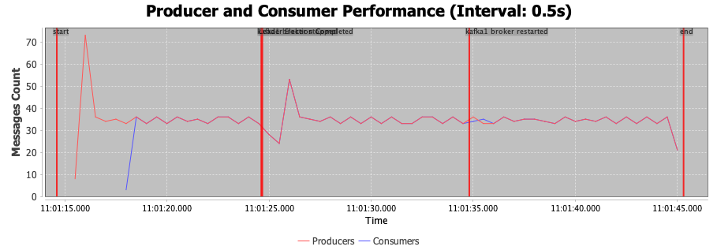

# Exercise 1 - Getting started with Kafka

The demo implementation (and further down the line all other implementation) has been done in a GitHub repository: `https://github.com/buehler/mcs-event-driven-systems/`.

Inside the`./demo` directory, there is a small demo of Kafka using Docker Compose and dotnet. The consumer and producer are implemented in C# using the Confluent.Kafka library. The producer sends one message each second with the unix timestamp and the topic is called `clock`. To run the application, go into the `./demo` directory and run `docker compose up`. It includes and configures Kafka from the root directory and also fires up the producer and consumer (and builds them first if necessary). If any changes are made to the code of the producer and/or consumer, you'll need to rebuild the docker files using `docker compose build`.

## Task 2 - Experiments with Kafka
All code for the experiments regarding exercise 2 are exclusively under /exercise1

This means all commands shown below must be run from the corresponding path.
### Basic setup
#### Setting your IP address
Set the correct KAFKA_ADVERTISED_HOST_NAME and KAFKA_ADVERTISED_LISTENERS in [docker-compose.yml](../../exercise1/docker/docker-compose.yml) (exercise1/docker/)

Also set the correct address here [KafkaFailoverDockerTest.java](../../exercise1/faultToleranceTest/src/test/java/com/experiments/KafkaFailoverDockerTest.java) for the fault tolerance test.
There are several places to replace the address, search and replace is your friend.

```
        props.put("bootstrap.servers", "10.0.73.164:9092,10.0.73.164:9093,10.0.73.164:9094");
``` 

#### Build packages
Don't forget to build the packages. Must be run from the folder with the .pom file.
```
$  mvn clean package
``` 

### 1. Producer Experiments
Start docker with the producer profile (run from /experiments1/docker)

```
$  docker compose --profile producer up -d
``` 
There are many two classes for different testing purposes. We did not change the pom file all the time.
The poms therefore contain the following as a reminder:
```
<manifest>
   <mainClass>read_EDPO_T1_E1.md</mainClass>
</manifest>
```
To run the services the correct main class must be stated in the command.
#### Batch Size & Processing Latency


Uses this main class for this test: [ProducerExperimentBatchSizeClicksProducer.java](../../exercise1/producerTests/src/main/java/com/experiments/ProducerExperimentBatchSizeClicksProducer.java)

**Note**: Must be run from the exercise1/producerTests/target subfolder.
```
$  java -cp pubsub-producer-1.0-SNAPSHOT-jar-with-dependencies.jar com.experiments.ProducerExperimentBatchSizeClicksProducer
``` 

##### Experiment Setup
- Batch Sizes tested:
    - `1024 bytes`
    - `4096 bytes`
    - `16384 bytes`
    - `65536 bytes`
    - `262144 bytes`
    - `1048576 bytes`
- Total Messages: Each batch size sends `50,000` messages.
- Kafka Producer Settings:
    - `linger.ms = 5`: Ensures a consistent delay before sending messages.
    - `buffer.memory = 32MB`: Default Kafka buffer memory.

##### Metrics Measured
- Duration (ms): Total time taken to send all messages.
- Throughput (msgs/sec): The number of messages sent per second.
- Average Latency (ms): The average time it takes for a message to be sent and acknowledged by Kafka.

##### Experiment Results

| Batch Size | Messages | Duration (ms) | Throughput    | Avg Latency (ms) |
|------------|----------|---------------|---------------|------------------|
| 1024       | 50000    | 1320          | 37878.79      | 607.96           |
| 4096       | 50000    | 559           | 89445.44      | 57.59            |
| 16384      | 50000    | 421           | 118764.85     | 6.94             |
| 65536      | 50000    | 354           | 141242.94     | 3.94             |
| 262144     | 50000    | 411           | 121654.50     | 8.18             |
| 1048576    | 50000    | 365           | 136986.30     | 18.46            |


##### Observations
Throughput:
- Throughput increases significantly as the `batch.size` grows.
- Larger batch sizes reduce the overhead of network communication by allowing more messages to be sent in a single request, thus improving efficiency.
- Maximum throughput is achieved at a batch size of `65536`, with 141242.94 messages/sec.

Latency Trade-off:
- Average latency per message decreases and becomes negligible at batch sizes up to `65536`.
- However, at larger batch sizes (e.g., `262144` and `1048576`), the average latency increases again to 8.18 ms and 18.46 ms respectively. This is due to the delays introduced by waiting to fill larger batches, despite the gains in throughput.

##### Key Insights for our project

Small Batch Sizes:
- When the `batch.size` is too small (e.g., `1024`), both throughput and latency suffer due to frequent network communication and higher per-message overhead. --> We don't want that.

Medium Batch Sizes:
- Moderate batch sizes (e.g., `16384 - 65536`) are balanced between throughput and latency. --> Seems suitable for us.

Large Batch Sizes:
- While large batch sizes (e.g., `262144` or `1048576`) deliver very high throughput, they slightly compromise latency. --> We prefer immediate message delivery.
---

#### Load Testing
Uses this main class for this test: [ProducerExperimentLoadTestClicksProducer.java](../../exercise1/producerTests/src/main/java/com/experiments/ProducerExperimentLoadTestClicksProducer.java)

**Note**: Must be run from the exercise1/producerTests/target subfolder.
```
$  java -cp pubsub-producer-1.0-SNAPSHOT-jar-with-dependencies.jar com.experiments.ProducerExperimentLoadTestClicksProducer
``` 
##### Experiment Setup
- Base producer properties are loaded from a `producer.properties` configuration file.
- A fixed batch size of `16384` is used for each experiment.
- Up to 5 concurrent producers are tested.
- Total messages to send per experiment: `8,000,000`.
- `acks`:`1`
- `retries`:`0`
- Kafka Topic Setup:
    - Single partition and replication factor of one for all topics.

- Experiment Iteration:
    - For each producer count (1 to 5):
        - Producers execute message sending concurrently.
        - Each producer sends its share of the total messages.
        - Experiment duration, throughput, latency, and resource usage are measured and recorded.

##### Metrics Measured
See table.

##### Experiment Results

| Batch Size | Producers | Messages Sent | Duration (ms) | Throughput (msg/sec) | Avg Latency (ms) | Message Drop | Dropped (%) | Avg CPU (%) | Avg Memory (MB) |
|------------|-----------|---------------|---------------|-----------------------|------------------|--------------|-------------|-------------|-----------------|
| 16384      | 1         | 7900776       | 6075          | 1300512.76           | 30.39            | 99385        | 1.24        | 63.79       | 2281.52         |
| 16384      | 2         | 7704802       | 4484          | 1718287.69           | 177.64           | 295198       | 3.69        | 89.91       | 2224.71         |
| 16384      | 3         | 7249508       | 4797          | 1511258.70           | 422.96           | 750490       | 9.38        | 51.77       | 2534.69         |
| 16384      | 4         | 6914848       | 4377          | 1579814.48           | 492.23           | 1085152      | 13.56       | 37.50       | 1354.18         |
| 16384      | 5         | 6622923       | 4202          | 1576135.89           | 601.33           | 1377077      | 17.21       | 64.35       | 1871.41         |


##### Observations
Throughput:
- Maximum throughput was achieved with `2 producers`, reaching 1,718,287.69 messages/sec.
- Increasing the number of producers beyond 2 caused slight inconsistencies in throughput performance.

Latency:
- As the number of producers increased, average latency per message increased significantly.
    - Lowest latency observed with 1 producer: 30.39 ms.
    - Highest latency observed with 5 producers: 601.33 ms.

Message Drops:
- Message drop rate (%) increased as the number of producers increased:
    - 1 producer: 1.24% dropped messages.
    - 5 producers: 17.21% dropped messages.

Resource Usage:
- CPU Usage: CPU usage peaked at 89.91% with 2 producers, but fluctuated under heavier producer loads.
- Memory Usage: Memory usage varied between 1354.18 MB and 2534.69 MB, with no clear linear trend observed across producer counts.


##### Key Insights for our project
- The number of high volume producer must match the number of brokers. If there are to many producers, the broker can get overwhelmed which results in message drop.

---

### 1. Consumer Experiments
Start docker with the producer profile

```
$  docker compose --profile producer up -d
``` 

To run the services the correct main class must be stated in the command.
#### Consumer Lag & Data Loss Risks

**Note**: Must be run from the /exercise1/consumerTests/target subfolder.
```
$  java -jar target/pubsub-consumer-1.0-SNAPSHOT-jar-with-dependencies.jar
``` 

##### Experiment Setup
- Kafka Consumer-Producer Configuration:
    - Topic: `click-events` with a single partition.
    - Producer: Sends messages at different rates: 500, 1000, and 1500 messages/second.
    - Consumer: Simulates processing delays at intervals of 0 ms, 200 ms, 400 ms, and 600 ms.
    - Producer and Consumer run concurrently for a fixed test duration of 5 seconds.

- Testing Process:
    1. Delete all existing topics to start fresh for each experiment.
    2. Create a new topic and verify its readiness.
    3. Configure the producer to send messages at different rates.
    4. Measure consumer performance under various processing delays.
    5. Compute and aggregate metrics for each producer rate and delay combination.

- Duration:
    - Each test combination (rate x delay) runs for 5000 ms (5 seconds).

##### Metrics Measured
See table.

##### Experiment Results

| Messages/Sec | Processing Delay (ms) | Messages Processed | Avg Lag | Cumulative Lag |
|---------------|-----------------------|---------------------|---------|-----------------|
| 500           | 0                     | 1934                | 0       | 1768            |
| 500           | 200                   | 1836                | 0       | 1622            |
| 500           | 400                   | 1834                | 0       | 1830            |
| 500           | 600                   | 1968                | 1       | 2435            |
| 1000          | 0                     | 4178                | 1       | 7167            |
| 1000          | 200                   | 3671                | 1       | 5895            |
| 1000          | 400                   | 3586                | 1       | 6587            |
| 1000          | 600                   | 2000                | 4       | 9223            |
| 1500          | 0                     | 204880              | 90      | 18590332        |
| 1500          | 200                   | 163781              | 136     | 22301112        |
| 1500          | 400                   | 48947               | 365     | 17906927        |
| 1500          | 600                   | 2000                | 694     | 1389148         |


##### Observations

- Messages Processed:
    - At lower producer rates (500 msg/s), the consumer successfully handled most messages, even under higher processing delays.
    - At higher producer rates (1500 msg/s), the number of messages processed drastically reduced, especially with delays of 400 ms and 600 ms.

- Lag Behavior:
    - Average lag remains low for smaller producer rates (500, 1000 msg/s) but increases significantly at 1500 msg/s, especially under higher delays.
    - Cumulative lag dramatically spikes at 1500 msg/s with significant delays (e.g., 22301112 cumulative lag with 200 ms delay).

- Impact of Processing Delay:
    - At 500 msg/s and 1000 msg/s, delays up to 400 ms show minimal impact on lag and messages processed.
    - At 1500 msg/s, processing delays (400 ms and 600 ms) cause severe drops in messages processed and high lag values.


##### Key Insights for our project
For our application, we have to keep in mind, that the production rate and consumption delay have to be balanced to guarantee stable balance between high throughput and low lag.

High producer rates, coupled with significant processing delays, overload the consumer. This indicates the need for tuning Kafka consumer properties or introducing additional partitions and consumers to handle higher workloads.

Therefore we conclude:
- Scale horizontally by increasing the number of partitions and adding parallel consumers if higher producer rates or longer processing delays are necessary.
- Optimize the consumer processing logic to reduce processing time per message, further minimizing the downstream lag.

---
### 3. Fault Tolerance & Reliability
#### Broker Failures & Leader Elections
Start docker with the fault profile (from the exercise 1 folder)
```
$ cd exercise1/docker
``` 
```
$  docker compose --profile fault up -d
``` 

The test consist of two parts:
1. gather the statistics
2. aggregate and visualize the results

##### Gather the statistics
To gahter the statistics run the test once. The console will also output some interesting numbers.
```
../faultToleranceTest
``` 
```
$ cd exercise1/faultToleranceTest
``` 

```
$  mvn test -Dtest=com.experiments.KafkaFailoverDockerTest
``` 
This will produce a new log file in [logs](../../exercise1/faultToleranceTest/logs)

##### Aggregate and visualize the results
To aggregate and visualize the results run the [LogVisualizationService.java](../../exercise1/faultToleranceTest/src/main/java/com/testEvaluation/LogVisualizationService.java) class.
We run it directly within IntelliJ.

###### Possible settings
The aggregate interval can be changed in [LogAggregator.java](../../exercise1/faultToleranceTest/src/main/java/com/aggregator/LogAggregator.java)
Just play with the following parameter in line 12:
```
timeIntervalInSeconds = 0.5
``` 
The interval must also be changed in [LogVisualizationService.java](../../exercise1/faultToleranceTest/src/main/java/com/testEvaluation/LogVisualizationService.java)

```
AGGREGATION_INTERVAL_SECONDS = 0.5
``` 


##### Experiment Setup
This experiment was conducted to evaluate the resilience and recovery behavior of an Apache Kafka cluster during broker failover and recovery scenarios. The setup emulates a real-world distributed streaming environment using Dockerized Kafka brokers, designed to assess leader election latency, message availability, and consumer recovery times.

- Test Topic: `test-replication-topic`
- Producers: Three concurrent producer threads sending messages to the topic.
- Consumers: One consumer thread consuming messages from the topic.
- Failure Simulation: The Docker container `kafka1` was stopped to simulate broker failure, and later restarted for recovery.

###### Cluster Configuration

- Kafka Cluster Size: 3 brokers (`kafka1`, `kafka2`, `kafka3`)
- Topic Setup:
  - Topic Name: `test-replication-topic`
  - Partitions: 3
  - Replication Factor: 3

###### Producer Settings (selection)

| Setting                         | Value    |
|---------------------------------|----------|
| `acks`                          | `all`    |
| `retries`                       | `3`      |
| `retry.backoff.ms`             | `500`    |
| `request.timeout.ms`           | `15000`  |
| `metadata.max.age.ms`          | `1000`   |
| `linger.ms`                    | `5`      |
| `max.in.flight.requests.per.connection` | `5` |
| `delivery.timeout.ms`          | `30000`  |
| `reconnect.backoff.ms`         | `500`    |
| `reconnect.backoff.max.ms`     | `10000`  |


###### Consumer Settings (selection)

| Setting                         | Value     |
|---------------------------------|-----------|
| `auto.offset.reset`            | `latest`  |
| `enable.auto.commit`           | `false`   |
| `max.poll.interval.ms`         | `60000`   |
| `fetch.max.wait.ms`            | `500`     |
| `max.poll.records`             | `500`     |
| `session.timeout.ms`           | `10000`   |
| `heartbeat.interval.ms`        | `1000`    |
| `request.timeout.ms`           | `40000`   |
| `fetch.min.bytes`              | `1`       |
| `reconnect.backoff.ms`         | `1000`    |
| `reconnect.backoff.max.ms`     | `10000`   |

###### Metrics Measured

- Broker Kill Time (ms): Time taken to simulate a broker failure.
- Leader Election Time (ms): Time taken for the Kafka cluster to elect new leaders for the partitions previously managed by the failed broker.
- Broker Restart Time (ms): Time taken to restart the stopped broker and rejoin the cluster.
- Consumer Lag (Messages): The difference between the total number of messages produced and consumed throughout the duration of the experiment.
- Producer Recovery Time (Node Failure): Time taken by producers to return to normal operation after the broker restarts.
- Consumer Recovery Time (Node Failure): Time taken by consumers to start receiving messages after the broker is restarted.
- Producer Recovery Time (Node Recovery): Time taken for producer to resume message delivery after broker restoration.
- Consumer Recovery Time (Node Recovery): Time taken for consumer to resume processing after broker recovery.
- Total Produced Messages: Total number of messages produced during the experiment.
- Total Consumed Messages: Total number of messages consumed during the experiment.
- Partitions Revoked and Assigned: The number of partition reassignment events observed during the consumer's rebalancing process.

All produced and consumed messages are logged. Also all events are logged. Those logs are used to plot the graph of all produced and consumed messages and the occurrences of events.


##### Experiment Results
The experiment results are summarized in the following table. When running the test, these numbers get output to the console.
The console ouput mentioned in this report can be found here [consoleOutput_2025-04-16_11-01-04.log](../../exercise1/faultToleranceTest/logs/Console%20Output/consoleOutput_2025-04-16_11-01-04.log)

| Metric                                 | Value                         |
|----------------------------------------|-------------------------------|
| Test Name                              | Kafka Broker Failover Test    |
| Topic Name                             | test-replication-topic        |
| Broker Kill Time (ms)                  | 10                            |
| Leader Election Time (ms)              | 53                            |
| Broker Restart Time (ms)               | 131                           |
| Consumer Lag (Messages)                | 199                           |
| Total Produced Messages                | 2057                          |
| Total Consumed Messages                | 1858                          |
| Test Successful                        | true                          |
| Revoked Partitions Count               | 3                             |
| Assigned Partitions Count              | 3                             |
| Producer Recovery Time (Node Failure)  | 41 ms                         |
| Consumer Recovery Time (Node Failure)  | 42 ms                         |
| Producer Recovery Time (Node Recovery) | 43 ms                         |
| Consumer Recovery Time (Node Recovery) | 45 ms                         |


The following graph was plotted with [LogVisualizationService.java](../../exercise1/faultToleranceTest/src/main/java/com/testEvaluation/LogVisualizationService.java). 
The logs used for this graph can be found here [exercise1_faultToleranceTest_2025-04-16_11-01-04.log](../../exercise1/faultToleranceTest/logs/exercise1_faultToleranceTest_2025-04-16_11-01-04.log)


##### Observations
1. Partition Leadership Transition  
   During the broker failover, all partitions transitioned to new leaders:
   - Partition 0: New leader = 2 
   - Partition 1: New leader = 3 
   - Partition 2: New leader = 2


2. Producer/Consumer Recovery Behavior  
   Both producers and the consumer resumed operations almost immediately after the leadership transition. The recovery time was minimal:
    - `kafka1` stopped: `11:01:24.619`
    - The first message produced after failover: `11:01:24.627`
    - The first message consumed after failover: `11:01:24.636`

3. Minimal Cluster Impact  
   Disabling one broker (`kafka1`) had minimal impact on the system. The cluster handled leader election efficiently, and the producers and consumer continued functioning with only a slight delay. This demonstrates the robustness of Kafka's failover mechanism.

4Partition Reassignment Events  
   The consumer experienced a rebalance, during which all three topic partitions were reassigned:
  - Partitions revoked: 3
  - Partitions assigned: 3  
    These transitions were handled automatically by Kafka with no loss in message processing continuity.

##### Key Insights for our project
- Kafka handles failover efficiently  
  Leader election and client recovery occurred in under 100 ms, with minimal disruption (~10 ms). Kafka's built-in replication and failover mechanisms proved highly reliable.

- No data loss observed  
  Message delivery remained consistent, and consumer lag was low despite the broker failure.

- Clients recover automatically  
  Producers and consumers handled disconnections gracefully without manual intervention.

- Seamless partition rebalancing  
  Partition reassignment and rebalancing occurred without affecting message flow or logic.

**Project implications**: We can rely on Kafka’s fault tolerance out of the box. With proper replication (≥ 3) and basic retry settings, the system remains highly available even during broker failures.


