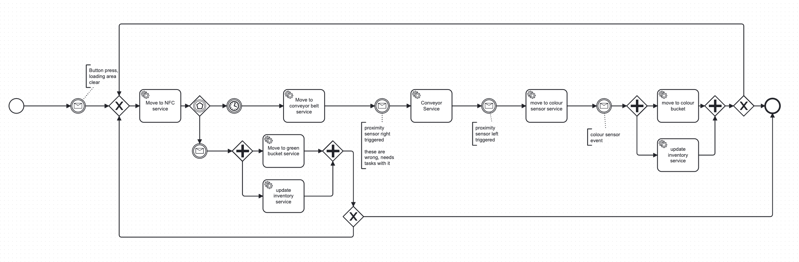

# Exercise 3 - Suggestions for Software Project

The implementations that have already been developed have been pushed to our public repo: `https://github.com/buehler/mcs-event-driven-systems/`.

Down below is the PBPMN that we created for our workflow. There is an annotated version showing the flows to the different Kafak topics on our Miro board. The link to this can be found at the bottom of the page. The annotated version, shows the emiters and listeners to different events and topics with Kafka as the message broker.

* The instance in Camunda is triggered by a request sent by our simple web front-end, this also transmitts the number of workpieces that will need to be sorted.
* To start the process for the physical robots, user needs to press a button next to the conveyor belt to make sure the workbench in clear and safe. This is depicted by a message catch event. This comes from the button and is emitted to the sensor kafka topic (see Miro for details).
* Next the Move to NFC service is activated. This publishes a command in the command Kafka topic. This is listed to and picked up by the corresponding robot service which executes the first task of picking up a workpiece and moving it onto the NFC sensor. Which workpiece is being worked on depends on the numver of workpieces that was transmitted and the couter.
* Next is an event-based gateway, if an NFC tag is detected, we know it is green (as only the green pieces have a tag). This leads to a command being emitted to move the workpiece to the green bucket and an event being emitted that is picked up by the inventory service to update the inventory on the front-end. The counter goes up by one so that the next workpiece can be processed
* If there is no event emitted by the NFC sensor after a certain amout of time, it can be assumed that the workpiece does not have an NFC tag. Therefore after this time-out the process continues to determine the colour of this not-green workpiece.
* Now the workpiece need to be moved from the NFC sensor to the conveyor belt. This is done by sending a command by the "move to conveyor service" which is listed to by the robot arm, which places the workpiece infront of the proximity sensor.
* When the proximity sensor registers the workpiece, through an event pubished in the sensor topic in Kafka, to process is continued.
* Similarly to before, now a command is sent to the conveyor belt, via the command Kafka topic. This moves the conveyor belt a predefined distance, which should end with the workpiece infront of the second proximity sensor.
* Once again, here the process is continued once the second proximity sensor has registered the workpiece and has emitted such as an event in the sensor topic in Kafka.
* Now a command is issued, via the Kafka command topic, to the second robot to pick up the workpiece and move it to the colour sensor.
* The colour sensor will emit an event into the sensor topic which is picked up by a message catch event in camunda, now camunda knows what colour the workpiece has.
* Based on the information, in parallel, a command is issued to the second robot to move the workpiece to the corresponding bucket and an even is sent to the events topic, so that the inventory can be updated.
* From this the counter in camunda is updated.
* If all workpieces have been processed, the instance is finished. If not all workpieces have been processed the processes goes back to the first stage, where a new workpiece is picked up.

There are still some open points that need to be adressed:

* currently only the inventory uses the events topic in Kafka, are there other events that are needed?

The ADRs that have been written on the architectual decisions are documented `/doc/adr` and will be updated regularly over the course of the semester. A few have been added since the last hand-in.

The contributions of the different team members can be found under`/doc/contributions_log` and will be updated regularly over the course of the semester.

Link to our Miro board: `https://miro.com/welcomeonboard/TmNQTEpOM3JLakVmVUx5K2tmbDE5Tmp6eVhGTmxuTHN3eTJlZUdHTm9ZbDdBZlZRUTFkMTVjcWVoeTNKMGE2TzQ5UUk2a29XVlZLcENzRmdTUytZVFJKQjVoZGh4enJvSHA3SlB0VTBKK3BjOUdkV3MwVXQ5QkQycHgySS90ZlZzVXVvMm53MW9OWFg5bkJoVXZxdFhRPT0hdjE=?share_link_id=771121353483`.
